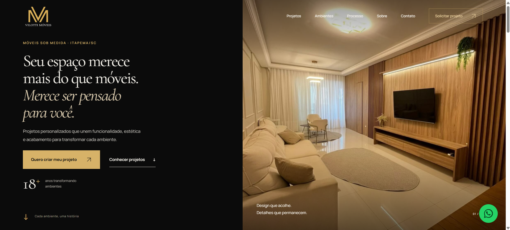

# Vilotti Móveis — Landing Page Institucional

<p align="center">
  <a href="https://assisfilipee.github.io/vilotti-moveis/" target="_blank">
    
  </a>
</p>

<p align="center">
  <strong>Landing page institucional desenvolvida para apresentar a Vilotti Móveis com uma experiência visual sofisticada, moderna e responsiva.</strong>
</p>

<p align="center">
  <a href="https://assisfilipee.github.io/vilotti-moveis/">
    🌐 Ver projeto online
  </a>
</p>

---

## Sobre o projeto

O projeto **Vilotti Móveis** foi desenvolvido com foco em transmitir sofisticação, exclusividade e atenção aos detalhes.

A proposta visual valoriza os ambientes e projetos da marca por meio de uma composição editorial, tipografia elegante, fotografias em destaque e uma navegação limpa.

Além do aspecto visual, a estrutura foi construída pensando em:

- experiência do usuário;
- responsividade;
- performance;
- acessibilidade;
- SEO;
- organização semântica do conteúdo;
- geração de contatos.

---

## Destaques

- Design premium e personalizado
- Layout totalmente responsivo
- Experiência otimizada para desktop, tablet e mobile
- Seções com composição editorial
- Galeria e apresentação de projetos
- Microinterações e animações sutis
- Navegação fluida
- Estrutura HTML semântica
- SEO técnico
- Otimização de imagens
- CTA estratégico para contato
- Código organizado e de fácil manutenção

---

## Tecnologias utilizadas

<p>
  
  
  
</p>

O projeto foi desenvolvido utilizando tecnologias web nativas:

- **HTML5**
- **CSS3**
- **JavaScript Vanilla**

Sem dependência de frameworks pesados, contribuindo para uma estrutura mais leve, rápida e fácil de manter.

---

## Estrutura do projeto

```text
vilotti-moveis/
│
├── assets/
│   ├── css/
│   │   └── style.css
│   │
│   ├── img/
│   │
│   └── js/
│
├── tests/
│
├── index.html
├── robots.txt
├── BRIEF.md
├── IMPLEMENTACAO.md
└── README.md
